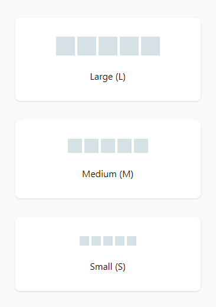
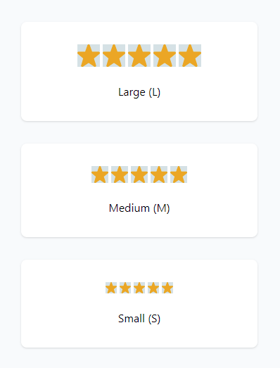
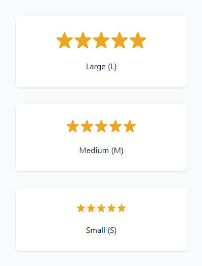
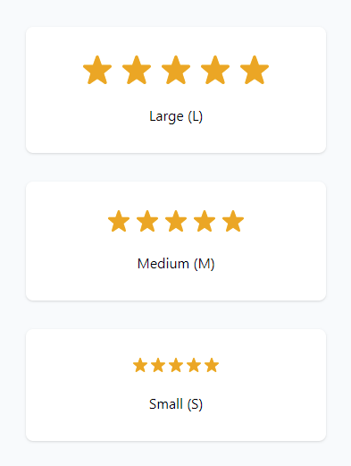
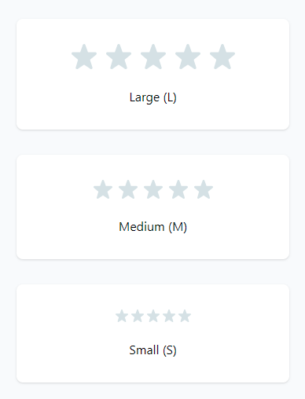
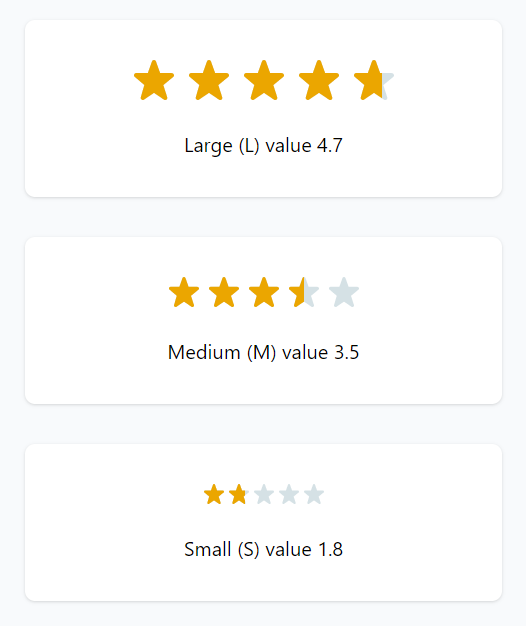
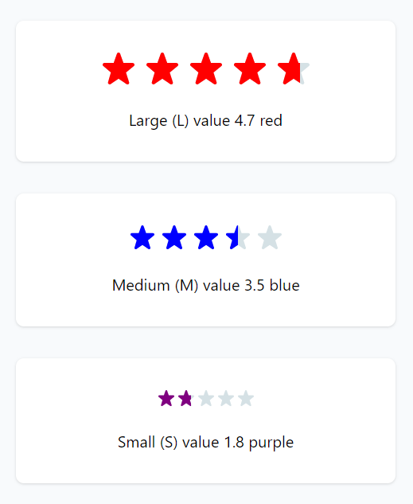

# star-rating
A Star Rating component, implemented as a custom element written in Typescript.

## This repo describes the process required to develop a Star Rating custom element in Typescript
In this case, I'm not going to use the boilerplate setup, since it has "lit" as a runtime dependency.

## Specification
Imagine you're a contributor to a component library and you're being tasked with creating a new component.
The new component you're going to be creating is a star rating component and below is the designs you've gotten from your designer.

The component must be accessible and work in the majority of browser; Edge, Chrome, Firefox and Safari Mobile/Safari Desktop.

## Local setup
- Linting is required, so code reviews can be done faster and without the "You missed a semi colon here!".
- Local server setup with hot module reload is enabled with rollup and esbuild for fast feedback.

## Installation
The following dev dependencies are installed.

- Code is of course written in Typescript.
	- typescript

- Linting is eslint with XO ruleset which is very harsh but powerful.
	- @typescript-eslint/eslint-plugin
    - @typescript-eslint/parser
    - eslint"
    - eslint-config-xo
    - eslint-config-xo-typescript

- Local server
	- Rollup with server / HMR.
		- @rollup/plugin-html
		- @rollup/plugin-node-resolve
		- @rollup/plugin-strip
		- rollup
		- rollup-plugin-clear
		- rollup-plugin-copy
		- rollup-plugin-esbuild
		- rollup-plugin-filesize
		- rollup-plugin-livereload
		- rollup-plugin-serve
		- rollup-plugin-typescript2

So to get started, you clone the repo:
```shell
git clone https://github.com/martinrossil/star-rating.git
```

Install dependencies:
```shell
npm install
```

Start local development server with Hot Module Reload:
```shell
npm run dev
```

## Implementation
When we start developing a class based custom element, written in Typescript,
we first identify the public interface and sub elements.

In this case, what properties / attributes the outside world can set.

There are two ways a custom element can be instantiated.

```ts
const starRating = new StarRating();
document.body.appendChild(starRating);
```
or as a html tag
```html
<star-rating></star-rating>
```

So we start by defining the interface that the StarRating element implements in IStarRating.ts.
```ts
export default interface IStarRating extends HTMLElement {
	/**
	 * Sets the current star rating, valid values are 0 - 5, both inclusive.
	 * Selectable values are on the other hand 1 - 5, both inclusive.
	 * Default value is NaN, which represents no value has been set.
	 */
	value: number;

	/**
	 * A boolean value that sets if the element is disabled or not.
	 * Default value is false.
	 */
	disabled: boolean;

	/**
	 * The star size, valid values are 'small', 'medium' and 'large'.
	 * small = 16px, medium = 24px and large = 32px.
	 * Default value is 'medium'.
	 */
	size: 'small' | 'medium' | 'large';

	/**
	 * A boolean value that sets if the element is read only or not.
	 * Default value is false.
	 */
	readOnly: boolean;
}
```

And implement this interface in the StarRating element.
```ts
import IStarRating from './IStarRating';

export default class StarRating extends HTMLElement implements IStarRating {
	public constructor() {
		super();
	}

	private _value = NaN;

	public get value() {
		return this._value;
	}

	public set value(value: number) {
		this._value = value;
	}

	private _disabled = false;

	public get disabled() {
		return this._disabled;
	}

	public set disabled(value: boolean) {
		this._disabled = value;
	}

	private _size: 'small' | 'medium' | 'large' = 'medium';

	public get size() {
		return this._size;
	}

	public set size(value: 'small' | 'medium' | 'large') {
		this._size = value;
	}

	private _readOnly = false;

	public get readOnly() {
		return this._readOnly;
	}

	public set readOnly(value: boolean) {
		this._readOnly = value;
	}
}
customElements.define('star-rating', StarRating);
```

We now have to syncronize the properties and attributes, so when one changes, the
other updates aswell.

We add the static class member observedAttributes() above the constructor,
to watch for attributes changes.
The method should return an Array of strings, representing the attribute names.
Be careful, no uppercase characters!

```ts
public static get observedAttributes() {
	return ['value', 'disabled', 'size', 'readonly'];
}
```

And add the attributeChangedCallback() method at the bottom of the class.

```ts
public attributeChangedCallback(name: string, oldValue: string | null, newValue: string) {

}
```

We implement attribute changes that sets the property.

```ts
private valueAttributeChanged(value: string) {
	this.value = parseFloat(value);
}

private disabledAttributeChanged(value: string) {
	this.disabled = value === '';
}

private sizeAttributeChanged(value: string) {
	if (value === 'small' || value === 'medium' || value === 'large') {
		this.size = value;
	}
}

private readonlyAttributeChanged(value: string) {
	this.readOnly = value === '';
}

public attributeChangedCallback(name: string, oldValue: string | null, newValue: string) {
	switch (name) {
		case 'value': this.valueAttributeChanged(newValue);
			break;
		case 'disabled': this.disabledAttributeChanged(newValue);
			break;
		case 'size': this.sizeAttributeChanged(newValue);
			break;
		case 'readonly': this.readonlyAttributeChanged(newValue);
			break;
		default: break;
	}
}
```

We now have to implement setter runtime guards and property -> attribute syncronization.

When the value attribute changes we call this method.

```ts
private valueAttributeChanged(value: string) {
	this.value = parseFloat(value);
}
```

We are sure that the parseFloat(value) returns a number data type, but we can't be sure it's not
between the 0 - 5 range, so we need to add runtime checks for this.

We implement guards in the value setter like this.
The return early pattern is used to avoid deeply nested if statements.

```ts
public set value(value: number) {
	if (this._value === value) {
		return;
	}

	// NaN is one of those funny js things where NaN !== NaN,
	// so we guard for this aswell.
	if (isNaN(this._value) && isNaN(value)) {
		return;
	}

	// If value is out of range, we reset to NaN.
	if (value < 0 || value > 5) {
		this._value = NaN;
		return;
	}

	this._value = value;
}
```

We now need to syncronize the attributes when the property changes.

We add propertyChanged methods, that we use to syncronize the attributes and update the UI.

```ts
private valueChanged() {
	if (isNaN(this.value)) {
		this.removeAttribute('value');
	} else {
		this.setAttribute('value', this.value.toString());
	}
}

public set value(value: number) {
	if (this._value === value) {
		return;
	}

	// NaN is one of those funny js things where NaN !== NaN,
	// so we guard for this aswell.
	if (isNaN(this._value) && isNaN(value)) {
		return;
	}

	// If value is out of range, we reset to NaN.
	if (value < 0 || value > 5) {
		this._value = NaN;
		this.valueChanged();
		return;
	}

	this._value = value;
	this.valueChanged();
}
```

Time to implement sub elements that will show the actual stars.

So let's create a StarBold custom element that will show a single star / SVG graphics.

```ts
export default class StarBold extends HTMLElement {
	public constructor() {
		super();
	}
}
customElements.define('star-bold', StarBold);
```

We are now entering OOP territory, where we will start to think about abstraction level.

The size behavior for the star-rating element, indicates that the element will resize the 5 child stars
and the parent element will expand / retract based on their size like a normal container.

So setting the size attribute / property will pass down this value to the children, that will resize.

We will create a ISizeable interface that both the star-rating and the star-bold element will implement.
We cut the size from IStaRating and paste it into ISizeable like this.

```ts
export default interface ISizeable extends HTMLElement {
	/**
	 * The star size, valid values are 'small', 'medium' and 'large'.
	 * small = 16px, medium = 24px and large = 32px.
	 * Default value is 'medium'.
	 */
	size: 'small' | 'medium' | 'large';
}
```

And implement this interface in both element classes.

```ts
export default class StarRating extends HTMLElement implements IStarRating, ISizeable

export default class StarBold extends HTMLElement implements ISizeable
```

Typescript now yells at us, because StarBold doesn't have the size property, so let's implement that.
Since the child elements will be referenced by the parent element directly, we don't have to think
about implementing attribute syncronization, it's straight up properties.

StarBold now look like this, we still guard for safety measures.

```ts
import ISizeable from './ISizeable';

export default class StarBold extends HTMLElement implements ISizeable {
	public constructor() {
		super();
	}

	private sizeChanged() {
		// implement
	}

	private _size: 'small' | 'medium' | 'large' = 'medium';

	public get size() {
		return this._size;
	}

	public set size(value: 'small' | 'medium' | 'large') {
		if (this._size === value) {
			return;
		}

		// We have guarded this setter with types but we could be called from javascript,
		// so guard for correct values here aswell.
		if (value === 'small' || value === 'medium' || value === 'large') {
			this._size = value;
			this.sizeChanged();
		}
	}
}
customElements.define('star-bold', StarBold);

```

Now lets create 5 stars-bold elements and add them as children of our star-rating element.
This is done in the constructor, so they are instantiated outside the DOM.
Remember when the browser sees the <star-rating></star-rating> tag, it will behind the scenes,
call new StarRating() and append the instance to the document where the tag is positioned.

```ts
public constructor() {
	super();
	this.appendChild(new StarBold());
	this.appendChild(new StarBold());
	this.appendChild(new StarBold());
	this.appendChild(new StarBold());
	this.appendChild(new StarBold());
}
```

In the Elements tab in dev tools, we now see this.

```html
<star-rating>
	<star-bold></star-bold>
	<star-bold></star-bold>
	<star-bold></star-bold>
	<star-bold></star-bold>
	<star-bold></star-bold>
</star-rating>
```

We don't see anything on screen, so lets implement some physical size.

In the StarBold class constructor we add.

```ts
public constructor() {
	super();
	this.style.width = '24px';
	this.style.height = '24px';
	this.style.display = 'inline-block';
	this.style.background = '#d5e1e5';
}
```

Which will show this.


The star-rating element now has a size on screen 120px X 28px.

We now need the star-rating element to display the children horizontally with gaps between, we use flex for that.

In the StarRating constructor we now have this.

```ts
public constructor() {
	super();
	this.style.display = 'inline-flex';
	this.style.gap = '4px';
	this.appendChild(new StarBold());
	this.appendChild(new StarBold());
	this.appendChild(new StarBold());
	this.appendChild(new StarBold());
	this.appendChild(new StarBold());
}
```

And we now see this on screen.


With something on the screen, we should now implement the actual resizing of the stars when the size changes.

Lets first extract the code in the sizeChanged() method into a seperate method.

From this.

```ts
private sizeChanged() {
	// medium size is default, so only set the size attribute for small and large.
	if (this.size === 'small' || this.size === 'large') {
		this.setAttribute('size', this.size);
	} else {
		this.removeAttribute('size');
	}
}
```

To this.

```ts
private sizeChanged() {
	this.updateSizeAttribute();
}

private updateSizeAttribute() {
	// medium size is default, so only set the size attribute for small and large.
	if (this.size === 'small' || this.size === 'large') {
		this.setAttribute('size', this.size);
	} else {
		this.removeAttribute('size');
	}
}
```

We now update the children when the size changes.

```ts
private sizeChanged() {
	this.updateChildrenSize();
	this.updateSizeAttribute();
}

private updateChildrenSize() {
	this.childNodes.forEach(child => {
		// we check if the child is indeed a StarBold instance, some other tag
		// could be added somehow, allways be safe than sorry.
		if (child instanceof StarBold) {
			child.size = this.size;
		}
	});
}
```

In the StarBold class we implement resizing in the sizeChanged method.

```ts
private sizeChanged() {
	// medium is the default size that maps to 24 pixel.
	let px = 24;
	if (this.size === 'small') {
		px = 16;
	} else if (this.size === 'large') {
		px = 32;
	}

	this.style.width = px + 'px';
	this.style.height = px + 'px';
}
```

We now see this on screen.



Now lets render some stars!

The stars will be rendered using SVG, so lets implement that in the StarBold class.

We first create a path getter that returns a SVGPathElement.

```ts
private _path!: SVGPathElement;

private get path(): SVGPathElement {
	if (!this._path) {
		this._path = document.createElementNS('http://www.w3.org/2000/svg', 'path');
	}
	return this._path;
}
```

Then we create a svg getter that returns a SVGSVGElement, with the path as a child.

```ts
private _svg!: SVGSVGElement;

private get svg(): SVGSVGElement {
	if (!this._svg) {
		this._svg = document.createElementNS('http://www.w3.org/2000/svg', 'svg');
		this._svg.style.position = 'absolute';
		this._svg.style.overflow = 'visible';
		this._svg.setAttribute('fill', 'none');
		this._svg.setAttribute('viewBox', '0 0 24 24');
		this._svg.setAttribute('width', '24px');
		this._svg.setAttribute('height', '24px');
		this._svg.setAttribute('preserveAspectRatio', 'none');
		this._svg.appendChild(this.path);
	}

	return this._svg;
}
```

We add the svg as a child if the StarBold class in the constructor.

```ts
public constructor() {
	super();
	this.style.width = '24px';
	this.style.height = '24px';
	this.style.display = 'inline-block';
	this.style.background = '#d5e1e5';
	this.appendChild(this.svg);
}
```

When the star-bold element resizes, the svg should be updated aswell.
So we update the sizeChanged method to set the svg size.

```ts
private sizeChanged() {
	// medium is default size that maps to 24 pixel.
	let px = 24;
	if (this.size === 'small') {
		px = 16;
	} else if (this.size === 'large') {
		px = 32;
	}

	this.style.width = px + 'px';
	this.style.height = px + 'px';
	this.svg.style.width = px + 'px';
	this.svg.style.height = px + 'px';
}
```

When we are working with SVG, we should always see if we can compress the data without loss of quality.

We have the star-bold.svg

```html
<svg width="24" height="24" viewBox="0 0 24 24" fill="none" xmlns="http://www.w3.org/2000/svg">
	<path d="M4.07512 22.3085L6.21423 14.999L0.476607 10.1393C0.269663 9.96838 0.120233 9.73794 0.0485476 9.4792C-0.0231375 9.22047 -0.0136153 8.94595 0.0758251 8.69282C0.165265 8.43968 0.330304 8.22015 0.548596 8.06394C0.766889 7.90774 1.02789 7.82241 1.29627 7.8195H8.29337L10.7823 0.859942C10.8692 0.60817 11.0324 0.394579 11.2492 0.239984C11.466 0.0853893 11.7256 0 11.9918 0C12.2581 0 12.5177 0.0853893 12.7345 0.239984C12.9513 0.394579 13.1145 0.60817 13.2013 0.859942L15.7103 7.8695H22.7074C22.977 7.87512 23.2384 7.96323 23.4564 8.12197C23.6744 8.28072 23.8386 8.50247 23.9268 8.75737C24.015 9.01227 24.023 9.28809 23.9498 9.54768C23.8765 9.80728 23.7255 10.0382 23.5171 10.2093L17.6195 15.049L19.9086 22.2385C20.0126 22.4941 20.0319 22.7711 19.9638 23.0385C19.8956 23.3058 19.7436 23.5439 19.53 23.7184C19.3164 23.8929 19.0524 23.985 18.7769 23.9984C18.5014 24.0118 18.2289 23.9414 17.9994 23.7884L12.0148 19.7187L6.00432 23.7884C5.78082 23.9337 5.51778 24.0088 5.2514 23.9984C4.98503 23.988 4.72841 23.8907 4.51687 23.7284C4.30534 23.5661 4.14927 23.3431 4.07016 23.0885C3.99105 22.8338 3.99278 22.5621 4.07512 22.3085Z" fill="#292928"/>
</svg>
```

Go to SVGOMG here https://jakearchibald.github.io/svgomg/ and paste in the svg.

The bytes went from 679 to 253 bytes, that's 37% of the original size.
It's now been reduced to this without quality loss.

```html
<svg fill="none" xmlns="http://www.w3.org/2000/svg" viewBox="0 0 24 24">
  	<path d="M4.08 22.3 6.2 15 .48 10.14a1.31 1.31 0 0 1 .82-2.32h7L10.77.86a1.28 1.28 0 0 1 2.42 0l2.51 7.01h7a1.32 1.32 0 0 1 .8 2.34l-5.9 4.84 2.3 7.19A1.27 1.27 0 0 1 18.78 24c-.28.01-.55-.06-.78-.21l-6-4.07-6 4.07a1.3 1.3 0 0 1-.76.2 1.3 1.3 0 0 1-1.17-1.68Z" fill="#292928"/>
</svg>
```

We now copy the "d" attribute from the path tag and add it to the StarBold class in the path getter.

```ts
private get path(): SVGPathElement {
	if (!this._path) {
		this._path = document.createElementNS('http://www.w3.org/2000/svg', 'path');
		this._path.setAttribute('fill', '#eba600');
		this._path.setAttribute('d', 'M4.08 22.3 6.2 15 .48 10.14a1.31 1.31 0 0 1 .82-2.32h7L10.77.86a1.28 1.28 0 0 1 2.42 0l2.51 7.01h7a1.32 1.32 0 0 1 .8 2.34l-5.9 4.84 2.3 7.19A1.27 1.27 0 0 1 18.78 24c-.28.01-.55-.06-.78-.21l-6-4.07-6 4.07a1.3 1.3 0 0 1-.76.2 1.3 1.3 0 0 1-1.17-1.68Z');
	}

	return this._path;
}
```

We now see this on screen.



We remove the gray background from the star-bold element and we get this.



Lets update the gap between the stars when resizing, so it looks better.
In the star-rating element we add this.

```ts
private sizeChanged() {
	this.updateGapBetweenStars();
	this.updateChildrenSize();
	this.updateSizeAttribute();
}

private updateGapBetweenStars() {
	let gap = 8;
	if (this.size === 'small') {
		gap = 4;
	} else if (this.size === 'large') {
		gap = 12;
	}

	this.style.gap = gap + 'px';
}
```

And we get this.



## Half star / decimal implementation
ClipPath masking to the rescue!

ClipPath masking lets us use a path as masking for other elements, so now the path element will not be
visible, but punch a "hole" an show the content underneath.

We first change the path color to red, that is the standard color for the masking element.

```ts
private get path() {
	if (!this._path) {
		this._path = document.createElementNS('http://www.w3.org/2000/svg', 'path');
		this._path.setAttribute('fill', '#FF0000');
		this._path.setAttribute('d', 'M4.08 22.3 6.2 15 .48 10.14a1.31 1.31 0 0 1 .82-2.32h7L10.77.86a1.28 1.28 0 0 1 2.42 0l2.51 7.01h7a1.32 1.32 0 0 1 .8 2.34l-5.9 4.84 2.3 7.19A1.27 1.27 0 0 1 18.78 24c-.28.01-.55-.06-.78-.21l-6-4.07-6 4.07a1.3 1.3 0 0 1-.76.2 1.3 1.3 0 0 1-1.17-1.68Z');
	}

	return this._path;
}
```

That will show this:


We create a <rect> background element and append it to the SVG.

```ts
private get backgroundRect() {
	if (!this._backgroundRect) {
		this._backgroundRect = document.createElementNS('http://www.w3.org/2000/svg', 'rect');
		this._backgroundRect.setAttribute('width', '100%');
		this._backgroundRect.setAttribute('height', '100%');
		this._backgroundRect.setAttribute('fill', '#d5e1e5');
	}

	return this._backgroundRect;
}
```

Append it to the SVG underneath the star.

```ts
this._svg.appendChild(this.backgroundRect);
this._svg.appendChild(this.path);
```

That will show this.


We then create a value <rect> that will represent a value from 0 to 1 (0 to 100%)
and append it above the background like this.

Notice the width 50%, that will be a dynamic percentage later.

```ts
private get valueRect() {
	if (!this._valueRect) {
		this._valueRect = document.createElementNS('http://www.w3.org/2000/svg', 'rect');
		this._valueRect.setAttribute('width', '50%');
		this._valueRect.setAttribute('height', '100%');
		this._valueRect.setAttribute('fill', '#eba600');
	}

	return this._valueRect;
}
```

Append it to the SVG underneath the star and above the background.

```ts
this._svg.appendChild(this.backgroundRect);
this._svg.appendChild(this.valueRect);
this._svg.appendChild(this.path);
```

That will show this.


We now create a clipPath element with the actual path element as a child, that we can target as a mask like this.

```ts
private _clipPath!: SVGClipPathElement;

private get clipPath() {
	if (!this._clipPath) {
		this._clipPath = document.createElementNS('http://www.w3.org/2000/svg', 'clipPath');
		this._clipPath.appendChild(this.path);
	}

	return this._clipPath;
}
```

The path element is now a child of the clipPath element and not the svg element.
So we remove the path from the svg and add the clipPath element as a child instead.

```ts
this._svg.appendChild(this.backgroundRect);
this._svg.appendChild(this.valueRect);
this._svg.appendChild(this.clipPath);
```

With this code, we will now see this.


For an element to be masked, it has to set its clipPath style property to the "id" of the masking element, so we give the clipPath an id.

```ts
private get clipPath() {
	if (!this._clipPath) {
		this._clipPath = document.createElementNS('http://www.w3.org/2000/svg', 'clipPath');
		this._clipPath.setAttribute('id', 'mask');
		this._clipPath.appendChild(this.path);
	}

	return this._clipPath;
}
```

And set the clipPath style properties of our rectangles to this.

```ts
this._backgroundRect.style.clipPath = 'url(#mask)';
this._valueRect.style.clipPath = 'url(#mask)';
```

And we will now see this, which is exactly what we want.


There is one catch regarding clipPath masking that you have to be aware of.

The clipPath id is a global variable, so if you have more than one declared, which is very likely when using custom elements, you can end up using the wrong clipPath.

So instead, give the id a random generated value instead of static "mask" in this case and point to that when setting the clipPath style property.

## Correct value rendering of the stars

Each star is now rendering (50%), which is not correct, so lets first remove the 50% width of the valueRect, so we only have 100% height.

```ts
private get valueRect() {
	if (!this._valueRect) {
		this._valueRect = document.createElementNS('http://www.w3.org/2000/svg', 'rect');
		this._valueRect.setAttribute('height', '100%');
		this._valueRect.setAttribute('fill', '#eba600');
		this._valueRect.style.clipPath = 'url(#mask)';
	}

	return this._valueRect;
}
```

We now create an IStar interface, that demands a value property like this.

```ts
export default interface IStar extends HTMLElement {
	/**
	 * Sets the current star rating, valid values are 0 - 1, both inclusive.
	 * Default value is 0.
	 */
	value: number;
}
```

And implement this interface in the StarBold class like this.

```ts
export default class StarBold extends HTMLElement implements ISizeable, IStar
```

Typescript errors with.

```shell
Class 'StarBold' incorrectly implements interface 'IStar'. Property 'value' is missing in type 'StarBold' but required in type 'IStar'.
```

So lets implement the value setter and getter like this.

```ts
private _value = 0;

public get value() {
	return this._value;
}

public set value(value: number) {
	if (this._value === value) {
		return;
	}

	if (isNaN(value) || value < 0 || value > 1) {
		this._value = 0;
		return;
	}

	this._value = value;
}
```

This doesn't do anything, so lets implement a valueChanged method.

```ts
private valueChanged() {
	// We are certain that this.value is a value from 0 to 1,
	// so we can safely convert it to a percentage string respresentation.
	const percent = Math.floor(this.value * 100).toString() + '%';
	// And set the width attribute of the valueRect to this percent.
	this.valueRect.setAttribute('width', percent);
}
```

And add the calls to the value setter.

```ts
public set value(value: number) {
	if (this._value === value) {
		return;
	}

	if (isNaN(value) || value < 0 || value > 1) {
		this._value = 0;
		this.valueChanged();
		return;
	}

	this._value = value;
	this.valueChanged();
}
```

We will now see this.



Lets test it to see if the implementation is correct.

In the StarBold constructor, we set the value to 0.75 to test.

```ts
public constructor() {
	super();
	this.style.width = '24px';
	this.style.height = '24px';
	this.style.display = 'inline-block';
	this.appendChild(this.svg);
	this.value = 0.75;
}
```

And we see this, which is correct.


We remember to remove this in the constructor.

```ts
this.value = 0.75;
```

## Implementing <star-rating> value property / attribute to show stars correctly

We now head over to the <star-rating> element, where we have the valueChanged() method,
that currently updated the value attribute.

```ts
private valueChanged() {
	if (isNaN(this.value)) {
		this.removeAttribute('value');
	} else {
		this.setAttribute('value', this.value.toString());
	}
}
```

This method now has to update the child stars values aswell.
We know that that the value passed in is NaN or values from 0 to 5, so lets
first create a updateChildStarsValues() method.

```ts
private updateChildStarsValues() {
	
}
```

And call it from the valueChanged() method.

```ts
private valueChanged() {
	if (isNaN(this.value)) {
		this.removeAttribute('value');
	} else {
		this.setAttribute('value', this.value.toString());
	}

	this.updateChildStarsValues();
}
```

We first check to see if the value is NaN, which will set all the star values to 0, so we create a seperate method for that.

```ts
private resetAllChildStarValues() {
	this.childNodes.forEach(star => {
		if (star instanceof StarBold) {
			star.value = 0;
		}
	});
}
```

And call it if we have a NaN value.

```ts
private updateChildStarsValues() {
	if (isNaN(this.value)) {
		this.resetAllChildStarValues();
	}
}
```

Otherwise we loop over the stars and update their values with a new setStarValues() method.

```ts
private setStarValues() {
	const integer = Math.floor(this.value);
	let decimal = parseFloat((this.value - integer).toFixed(1));
	this.childNodes.forEach((star, index) => {
		if (star instanceof StarBold) {
			if ((index + 1) <= this.value) {
				star.value = 1;
			} else {
				star.value = decimal;
				decimal = 0;
			}
		}
	});
}
```

And we add the setStarValues() call.

```ts
private updateChildStarsValues() {
	if (isNaN(this.value)) {
		this.resetAllChildStarValues();
	} else {
		this.setStarValues();
	}
}
```

Which will result in the star values being shown correctly.



## Defining custom colors

The values for colors are hard typed, we should change this.
So we create a color properties / attributes interface IColorable.

```ts
export default interface IColorable extends HTMLElement {
	/**
	 * The color of the star value rectangle.
	 */
	color: string;

	/**
	 * The disabled color of the star value rectangle.
	 */
	disabledColor: string;

	/**
	 * The background color of the star background rectangle.
	 */
	backgroundColor: string;
}
```

And implement this interface in the StarRating and StarBold classes.

```ts
export default class StarRating extends HTMLElement implements IStarRating, ISizeable, IColorable

export default class StarBold extends HTMLElement implements ISizeable, IStar, IColorable
```

We jump over the implementation details, that can be read in the source code.

So if we change the html to this.

```html
<div class="card">
	<star-rating value="4.7" size="large" color="red"></star-rating>
	<p>Large (L) value 4.7 red</p>
</div>
<div class="card">
	<star-rating value="3.5" size="medium" color="blue"></star-rating>
	<p>Medium (M) value 3.5 blue</p>
</div>
<div class="card">
	<star-rating value="1.8" size="small" color="purple"></star-rating>
	<p>Small (S) value 1.8 purple</p>
</div>
```

We get this.



## Production build
- Production build is done with the Google Closure Compiler that outputs bundles 30% smaller than esbuild.